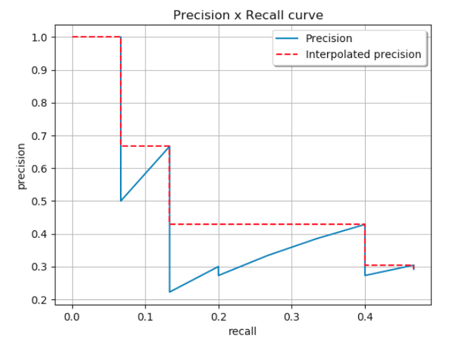
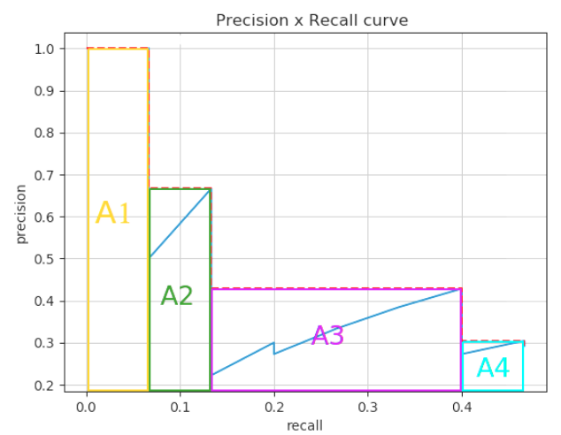
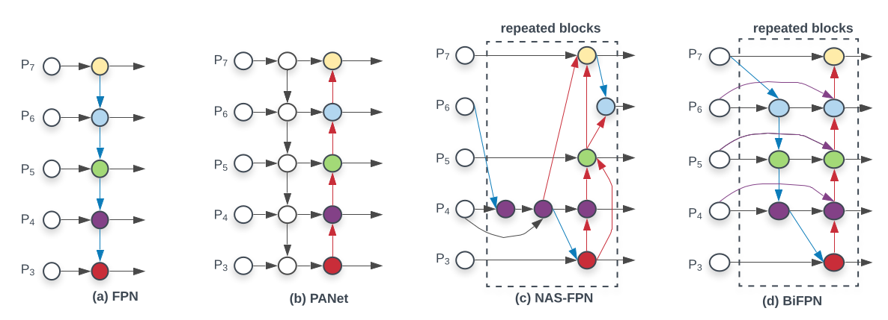
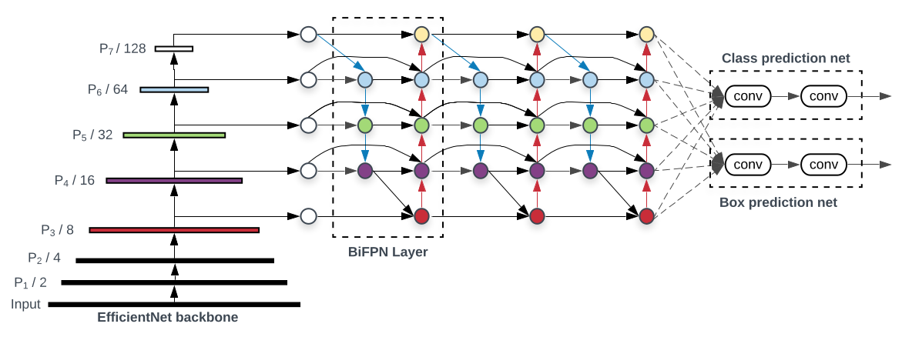
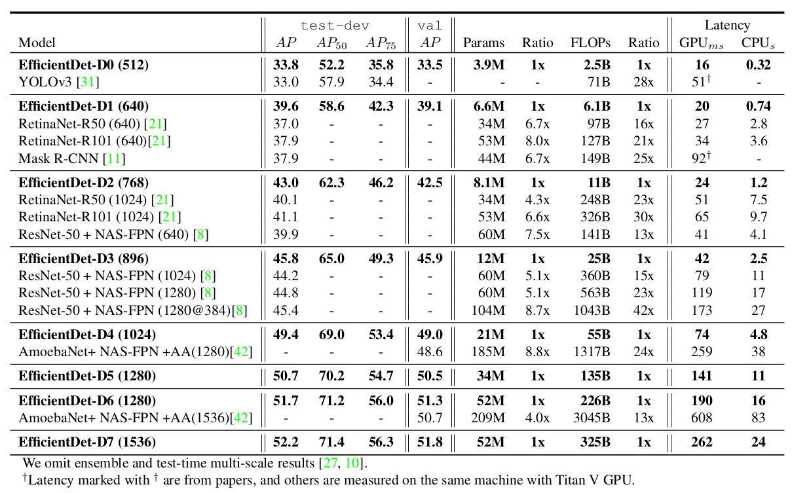
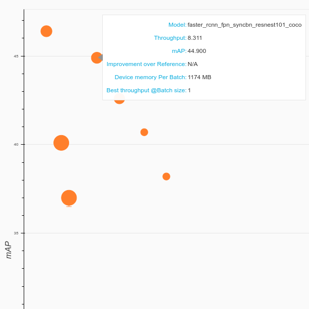
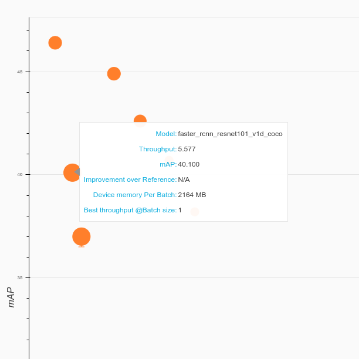
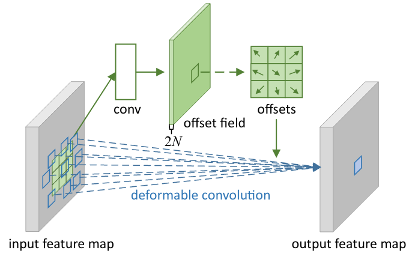
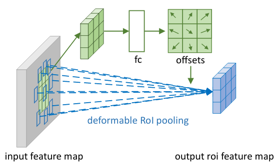
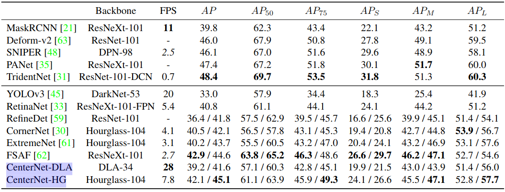

# Relevant object and human detection papers, notes and experimental code will stay here

## Object Detection

### Overview
- Basic approach:
  - Learning feature presentation:
    - Traditional Computer Vision Algorithms: SIFT, SURF, HOG
    - Deep Learning: extract feature using conventional network: VGG, Inception, Resnet, MobileNet, ...
  - Multi-scale: 
    - Pyramid Image: Scale up/down image, and run feature extraction repeatedly through each scale.
    - Feature Pyramid Network: Integrate Multi-scale prediction into backbone network to train end-to-end (FPN paper, ...)
  - Classification:
    - Bounding box regression: predict (x/xcenter, y/ycenter, w, h) using pre-defined anchor boxes. (Which leverages convergence).
      - Learnable anchor boxes (using clustering algorithm): YOLO
      - Pre-set anchor boxes (different ratios, scales): SSD
    - Class prediction:
      - Including background class: SSD, RCNN_family, ...
      - Non-including background class: YOLO (predict objectness score)
  - Loss Function:
    - Bounding box regression: L1 smooth, L2 losses
    - Class prediction: 
      - CrossEntropyLoss with Softmax: Hard Mining Background/Objects.
      - FocalLoss with Sigmoid: put lower weight on easy example, sigmoid is empirically more numerical stable.
  - Post process:
    - In most case, detectors usually generates a bunch possible bounding boxes.
      Therefore, NMS or more recently, SoftNMS, is used as a post-processing technique to suppress overlapping boxes.

*: In some github repo:
  - Networks in the first 2 steps are refered as backbone
  - Networks in the 3rd step are refered as head


### Evaluation Metrics:
- Coco evaluation metrics __*__:
  - AP (Average Precision): Area under the PR curve for each class (kind of hairy, examine paper for more info)
  
  
  - mAP (Mean Average Precision): is mean(AP_k) for k in K categories (which is AP value in Coco)
  - AR (Average Recall): 
  - mAR (Mean Average Recall): 

- Addition factors in Coco evaluation metrics:
  - Across scales: small, medium, large object (area: less 32x32, 32x32 -> 96x96, over 96x96)
  - Different IoU: 0.5 to 0.95 (step 0.05)
  - Max number of dectections per image: AR_max1 (1 detection __**__ per image), AR_max100 (100 detections per image)
  - TP (True Positive): score > threshold & matched class & IoU > threshold
  - FP (False Positive): not matched class or IoU < 0.5
  - FN (False Negative): score < threshold (# GT - TP)
  - Precision: TP/(TP + FP)
  - Recall: TP/(# GT)

__*__: higher the better

__**__(not sure): detection with highest score


### Models
- Divided into 2 paradigms: two-stage detector (with region-of-interest proposal step) vs single-stage detector (non region proposal step). More info:

  - [single stage](https://lilianweng.github.io/lil-log/2018/12/27/object-detection-part-4.html)
  - [two stages](https://lilianweng.github.io/lil-log/2017/12/31/object-recognition-for-dummies-part-3.html)


| | two-stage | single-stage|
|-|-----------|-------------|
|i.e.| R-CNN family | YOLO, SSD|
|adv | More accurate| More efficient|

- Multi-Scale Feature Presentations: predict on multi-scale feature maps (feature maps at different stride levels: /32 /64 ...)
  


### EfficientDet Model
- EfficientNet: [paper](https://arxiv.org/abs/1905.11946)
- Overall concepts:
  - In order to increase accuracy of the model, researchers usually scale up network in:
    - Depth(d): resnet18, resnet34, ...
    - Width/Channel(w): Number of channel in each Conv
    - Resolution(r): input image from 224x224 to 299x299, ...
  - This paper introduced a compound way to increase all three aspects.
  - Baseline model B0. B1 to B7 are scaled model from B0.
  - New model increases FLOPS & SPEED significantly, while retains competitive accuracy.

- Multi-Scale Features (same head: *classification & box regression net* in all fused feature maps)
  

- Anchors:
  - Three scales: 2^0, 2^(1/3), 2^(2/3)
  - Three ratios (w:h): 1:2, 1:1, 2:1
  - Strides: 2^i, for i in {3,4,5,6,7}
  - Anchor base size: 4 * stride (to predict object with min size = 32x32)
  - Anchor with [0, 0.4) IoU is assigned to background
  - Anchor with [0.5, 1] IoU is assigned to ground-truth objects
  - Anchor with [0.4, 0.5) IoU is ignored during training
  - Box regression is computed as offset between anchor and assigned object box (or omitted if no assignment).

- Classification Loss function (\alpha balanced variant of Focal loss):
  - \alpha = 0.25 and \gamma = 2.0 (From FocalLoss paper)
  - True class weight = \alpha * pow(1 - p, \gamma)
  - Wrong class weight = (1 - \alpha) * pow(p, \gamma)
  - Classification Loss = sum(loss_all_anchor) / number_of_anchor_with_0.5_IoU.

- Regression Loss function (L1 smooth)
  - Pseudo:
    ```
    if L1_dist < 1/9:
      loss = 0.5 * 9 * L2_dist
    else:
      loss = L1_dist - 0.5 / 0.9
    ```
  - Smooth L1-loss combines the advantages of L1-loss (steady gradients for large values of x) and L2-loss (less oscillations during updates when x is small).

- Evaluation:
  


### Miscellaneous
- [SoftNMS](https://arxiv.org/pdf/1704.04503.pdf) modify the confidence of the detection based on IoU overlap rather than suppressing it completely.
- [SpineNet](https://arxiv.org/pdf/1912.05027.pdf) weird design of model.
- [ResNeSt](https://arxiv.org/pdf/2004.08955.pdf) Modified version of the original Resnet, showed to improve downstream tasks such as Object Detection or Instance Segmentation. Results shown by Gluoncv imply that changing the backbone to ResNeSt (with SyncBatchNorm) can raise mAP by ~5%.
  |ResNeSt101|ResNet101|
  |----|----|
  |||
- [AdaptiveNMS](https://arxiv.org/pdf/1904.03629.pdf) More effective in crowded scene, but requires additional dense estimation head.
- [SNIPER](https://arxiv.org/pdf/1805.09300.pdf) Describe an effective way to sample object-region (512x512) to train model (by training a RPN for a few epoch) (Not sure how this is different from RandomIoUCropping). This allows training with large batch_size to utilize BatchNorm. However, SourceCode is not in prevalent DeepLearning Framework; hence, hard to try. Inference and training on Image Pyramid.
- [DCN](https://arxiv.org/pdf/1703.06211.pdf) Describe 2 modules which can be integrated into existing detection framework. 
  - Deformable convolution: generalized of dilated convolution, allowing broader and more flexible receptive field. Empirically shown to boost performance of detectors. (normal convol + offset convol)
  
  - Deformable ROI pooling: same as above, pooling with offset. Bins' value are sampled using Interpolation.
  
  - Version 2, called Modulated Deformable Convolution/Pooling, added an extra weight \delta_m in [0, 1]. This term mimics attention mechanism. For instance, if top-left ROI is unimportant, \delta_m is close to zero, and vice versa.
- [CenterNet](https://arxiv.org/pdf/1904.07850.pdf) introduces anchor free approach in Object Detection. The algorithm tries to localize the center point of the object using a heatmap W/R x H/R x C in [0, 1], where 1 indicates object and 0 suggests background. Depending on task, model can regress additional information. For example, object's box size (W, H) or Object's depth (in 3D case). This approach eliminates the necessary of using NMS in post processing. Nevertheless, the author pointed out that the model still suffer from overlapping center points (of 2 Different Objects) when projected into lower resolution feature map.
   
- 