# Relevant object and human detection notes and experimental code will stay here

## Object Detection

### Overview
- Basic approach:
  - Learning feature presentation:
    - Traditional Computer Vision Algorithms: SIFT, SURF, HOG
    - Deep Learning: extract feature using conventional network: VGG, Inception, Resnet, MobileNet, ...
  - Multi-scale: 
    - Pyramid Image: Scale up/down image, and run feature extraction repeatedly through each scale.
    - Feature Pyramid Network: Integrate Multi-scale prediction into backbone network to train end-to-end (FPN paper, ...)
  - Classification:
    - Bounding box regression: predict (x/xcenter, y/ycenter, w, h) using pre-defined anchor boxes. (Which leverages convergence).
      - Learnable anchor boxes (using clustering algorithm): YOLO
      - Pre-set anchor boxes (different ratios, scales): SSD
    - Class prediction:
      - Including background class: SSD, RCNN_family, ...
      - Non-including background class: YOLO (predict objectness score)
  - Loss Function:
    - Bounding box regression: L1 smooth, L2 losses
    - Class prediction: 
      - CrossEntropyLoss with Softmax: Hard Mining Background/Objects.
      - FocalLoss with Sigmoid: put lower weight on easy example, sigmoid is empirically more numerical stable.
  - Post process:
    - In most case, detectors usually generates a bunch possible bounding boxes.
      Therefore, NMS or more recently, SoftNMS, is used as a post-processing technique to suppress overlapping boxes.

*: In some github repo:
  - Networks in the first 2 steps are refered as backbone
  - Networks in the 3rd step are refered as head


### Evaluation Metrics:
- Coco evaluation metrics __*__:
  - AP (Average Precision): Area under the PR curve for each class (kind of hairy, examine paper for more info)
  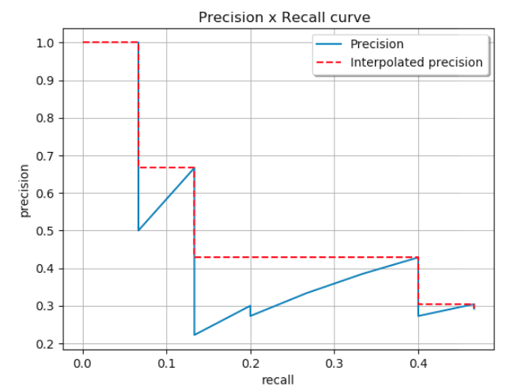
  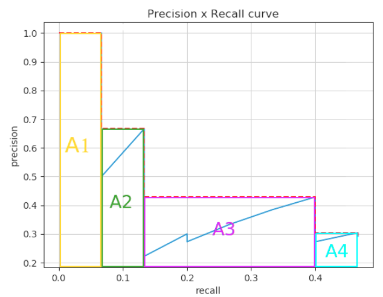
  - mAP (Mean Average Precision): is mean(AP_k) for k in K categories (which is AP value in Coco)
  - AR (Average Recall): 
  - mAR (Mean Average Recall): 

- Addition factors in Coco evaluation metrics:
  - Across scales: small, medium, large object (area: less 32x32, 32x32 -> 96x96, over 96x96)
  - Different IoU: 0.5 to 0.95 (step 0.05)
  - Max number of dectections per image: AR_max1 (1 detection __**__ per image), AR_max100 (100 detections per image)
  - TP (True Positive): score > threshold & matched class & IoU > threshold
  - FP (False Positive): not matched class or IoU < 0.5
  - FN (False Negative): score < threshold (# GT - TP)
  - Precision: TP/(TP + FP)
  - Recall: TP/(# GT)

__*__: higher the better

__**__(not sure): detection with highest score


### Models
- Divided into 2 paradigms: two-stage detector (with region-of-interest proposal step) vs single-stage detector (non region proposal step). More info:

  - [single stage](https://lilianweng.github.io/lil-log/2018/12/27/object-detection-part-4.html)
  - [two stages](https://lilianweng.github.io/lil-log/2017/12/31/object-recognition-for-dummies-part-3.html)


| | two-stage | single-stage|
|-|-----------|-------------|
|i.e.| R-CNN family | YOLO, SSD|
|adv | More accurate| More efficient|

- Multi-Scale Feature Presentations: predict on multi-scale feature maps (feature maps at different stride levels: /32 /64 ...)
  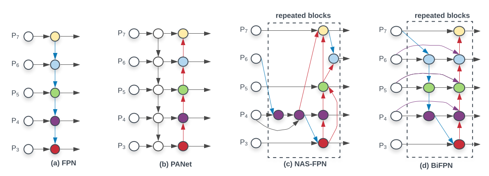


### EfficientDet Model
- EfficientNet: [paper](https://arxiv.org/abs/1905.11946)
- Overall concepts:
  - In order to increase accuracy of the model, researchers usually scale up network in:
    - Depth(d): resnet18, resnet34, ...
    - Width/Channel(w): Number of channel in each Conv
    - Resolution(r): input image from 224x224 to 299x299, ...
  - This paper introduced a compound way to increase all three aspects.
  - Baseline model B0. B1 to B7 are scaled model from B0.
  - New model increases FLOPS & SPEED significantly, while retains competitive accuracy.

- Multi-Scale Features (same head: *classification & box regression net* in all fused feature maps)
  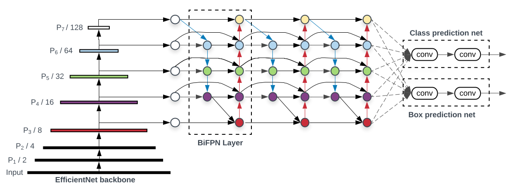

- Anchors:
  - Three scales: 2^0, 2^(1/3), 2^(2/3)
  - Three ratios (w:h): 1:2, 1:1, 2:1
  - Strides: 2^i, for i in {3,4,5,6,7}
  - Anchor base size: 4 * stride (to predict object with min size = 32x32)
  - Anchor with [0, 0.4) IoU is assigned to background
  - Anchor with [0.5, 1] IoU is assigned to ground-truth objects
  - Anchor with [0.4, 0.5) IoU is ignored during training
  - Box regression is computed as offset between anchor and assigned object box (or omitted if no assignment).

- Classification Loss function (\alpha balanced variant of Focal loss):
  - \alpha = 0.25 and \gamma = 2.0 (From FocalLoss paper)
  - True class weight = \alpha * pow(1 - p, \gamma)
  - Wrong class weight = (1 - \alpha) * pow(p, \gamma)
  - Classification Loss = sum(loss_all_anchor) / number_of_anchor_with_0.5_IoU.

- Regression Loss function (L1 smooth)
  - Pseudo:
    ```
    if L1_dist < 1/9:
      loss = 0.5 * 9 * L2_dist
    else:
      loss = L1_dist - 0.5 / 0.9
    ```
  - Smooth L1-loss combines the advantages of L1-loss (steady gradients for large values of x) and L2-loss (less oscillations during updates when x is small).

- Evaluation:
  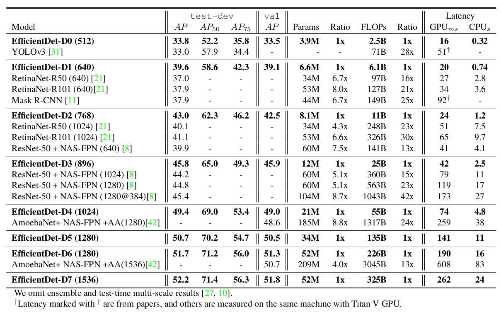

- Speed (reported by authors): on single Tesla V100 without using TensorRT
  * Note: EfficientDet-d3/4: is a nice trade off between speed and accuracy
  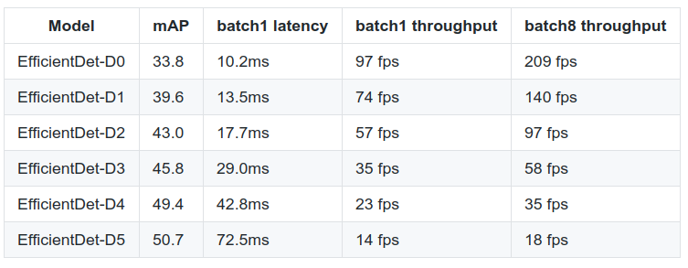


### Miscellaneous
- [SoftNMS](https://arxiv.org/pdf/1704.04503.pdf) modify the confidence of the detection based on IoU overlap rather than suppressing it completely.
- [SpineNet](https://arxiv.org/pdf/1912.05027.pdf) weird design of model.
- [ResNeSt](https://arxiv.org/pdf/2004.08955.pdf) Modified version of the original Resnet, showed to improve downstream tasks such as Object Detection or Instance Segmentation. Results shown by Gluoncv imply that changing the backbone to ResNeSt (with SyncBatchNorm) can raise mAP by ~5%.
  |ResNeSt101|ResNet101|
  |----|----|
  |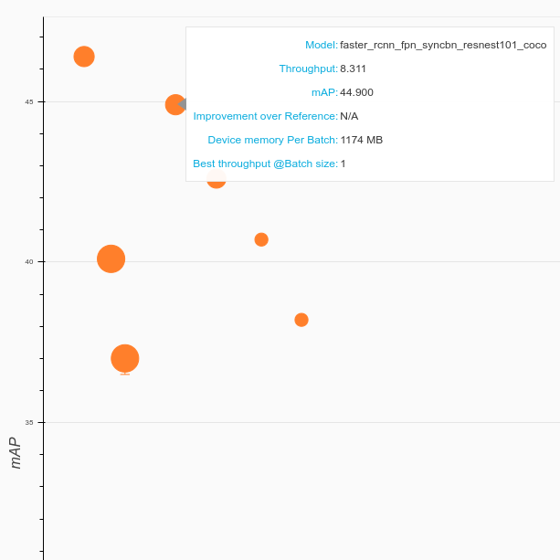|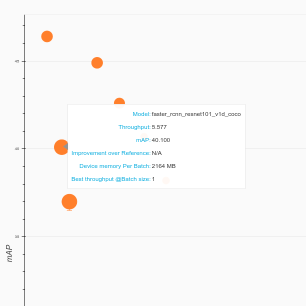|
- [AdaptiveNMS](https://arxiv.org/pdf/1904.03629.pdf) More effective in crowded scene, but requires additional dense estimation head.
- [SNIPER](https://arxiv.org/pdf/1805.09300.pdf) Describe an effective way to sample object-region (512x512) to train model (by training a RPN for a few epoch) (Not sure how this is different from RandomIoUCropping). This allows training with large batch_size to utilize BatchNorm. However, SourceCode is not in prevalent DeepLearning Framework; hence, hard to try. Inference and training on Image Pyramid to achieve scale invariant.
- [DCN](https://arxiv.org/pdf/1703.06211.pdf) Describe 2 modules which can be integrated into existing detection framework. 
  - Deformable convolution: generalized of dilated convolution, allowing broader and more flexible receptive field. Empirically shown to boost performance of detectors. (normal convol + offset convol)
  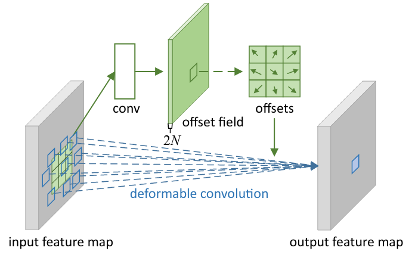
  - Deformable ROI pooling: same as above, pooling with offset. Bins' value are sampled using Interpolation.
  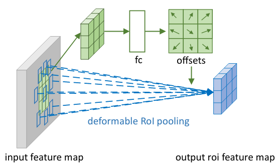
  - Version 2, called Modulated Deformable Convolution/Pooling, added an extra weight \delta_m in [0, 1]. This term mimics attention mechanism. For instance, if top-left ROI is unimportant, \delta_m is close to zero, and vice versa.
- [CenterNet - Object-as-Points](https://arxiv.org/pdf/1904.07850.pdf) introduces anchor free approach in Object Detection. The algorithm tries to localize the center point of the object using a heatmap W/R x H/R x C in [0, 1], where 1 indicates object and 0 suggests background. Depending on task, model can regress additional information. For example, object's box size (W, H) or Object's depth (in 3D case). This approach eliminates the necessary of using NMS in post processing. Nevertheless, the author pointed out that the model still suffer from overlapping center points (of 2 Different Objects) when 2 center points are projected into lower resolution feature map.
  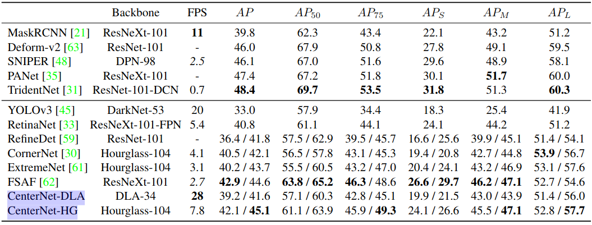
- [CenterNet triplet points](https://arxiv.org/pdf/1904.08189.pdf) is an upgraded version of CornerNet. The model tries to detects the center points in addition of 2 corners points for each objects. The authors realized that corner points has high FD (False Discovery rates = 1 - AP). Therefore, they proposed a solution by checking whether the central region contains the center points (of the same class) or not. Furthermore, they introduced a way to enrich center and corner information, by finding the maximum and minimum values in both horizontal and vertical direction and adding them together (refer to paper for details). Yet, model still relies on Soft-NMS to filter false positive predictions.

- [YOLOv4](https://arxiv.org/pdf/2004.10934.pdf) is an efficient object detection model. 43.5 mAP with 62 FPS (on V100). The model combines several ideas:
  - Bag-of-specials: CSPDarknet, SPP, PAN, Mish activation, DIoU NMS, ...
  - Bag-of-freebies: 
    - Augmentation: CutMix, Mosaic
    - Regularization: DropBlock
    - Class label smoothing
    - Scheduler: Cosine Annealing
    - ...
  
- [DETR - DEtection TRansformer](https://ai.facebook.com/research/publications/end-to-end-object-detection-with-transformers) introduces a new idea to detect an object by treating image as a series of blocks. In the first stage, an CNN is used to extract spatial information. Subsequently, the feature map NxCxHxW is flatten into NxCxHW (together with positional encoding), and later be feed into a Transformer. Afterwards, the decoder outputs a list of "predictions" (100 object queries in default setup) which are passed through an FFN (Feed forward network) to output object-class (including background) and corresponding bounding boxes. Finally, the association (predictions - ground truth) is done by the bipartite loss. (Code not yet fully available - lacking some functions)
  - Workflow as follow:
  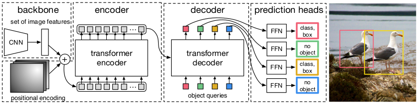
  - Speed is relatively good (at **27/12/20/10** FPS respectively in the figure)
  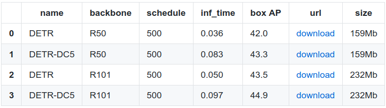

- [GIoU loss](https://arxiv.org/pdf/1902.09630.pdf). The authors pointed out that the widely used SmoothL1 loss can results in low IoU boxes. Therefore, they proposed an alternative loss called GIoU .
  - Formulation: 
  L_GIoU = 1 - GIoU = 1 - (IoU - (C - Union)/C), where C is the area of "Largest box containing both boxes)
  - GIoU range from -1 to 1, with 1 denotes high overlapping.
  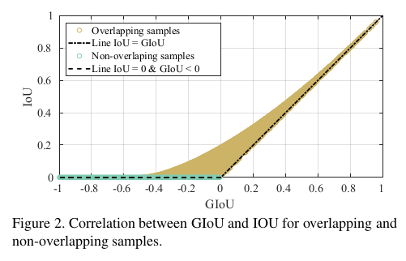

- [Cascade RCNN](https://arxiv.org/pdf/1906.09756.pdf). The authors redesign the network architecture in cascade mode (Right figure). Basically, the IoU to filter objects increases from stage-to-stage [0.5, 0.6, 0.7]. The results show clear performance (by ~2 mAP) compared to Faster-RCNN regardless of backbones.
  - Normal Faster-RCNN vs Cascade-RCNN
  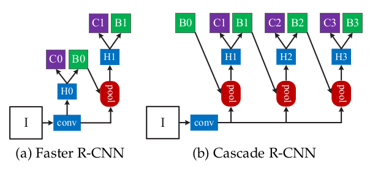
  
  |Faster-RCNN|Cascade-RCNN|
  |-----|-----|
  |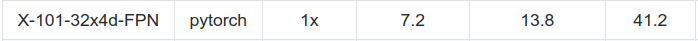|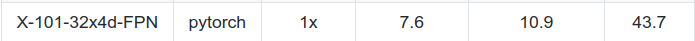|

- [YOLO v3](https://arxiv.org/pdf/1804.02767.pdf). Implemented in (https://github.com/ultralytics/yolov3) Achieve comparable accuracy (43.1 single-scale 45.6 multi-scale on **coco2014 - different train/val split**)while running at real-time speed (30 FPS on GTX 1070)

- [DetectoRS](https://arxiv.org/pdf/2006.02334v1.pdf) introduces 2 plug-and-play modules to enhance performance of base-line HTC (Hybrid Task Cascade) model.
  - First is the new multi-scale features: As described by the authors that stimulate *looking twice* mechanism of human's vision.

  |Normal FPN|Recursive Feature Pyramid|
  |----------|-------------------------|
  |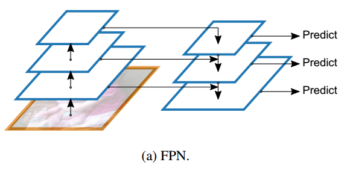|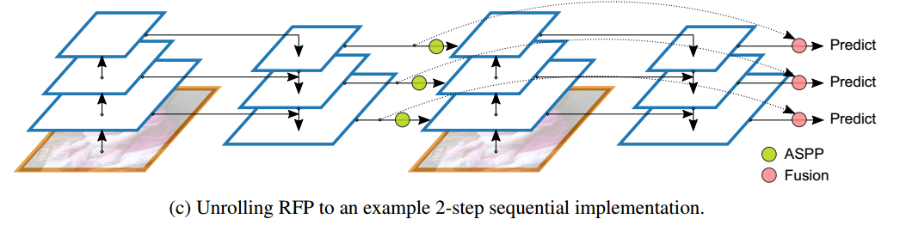|

  - Second is the Switchable Atrous Convolution (SAC) layer, which try to select which dilation rate (1 or 3 in paper) to detect different size objects. (Result in better large-object detection). Lock means weights are shared (except for \delta_w). The authors argue that objects at different scales can be roughly detected by same weights with different atrous rate; Hence, they inits \w from pretrained model and \delta_w to 0. In addition, both Conv3x3 in SAC module are replaced with DCN.
  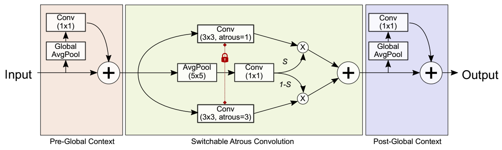
  
  - Result, the model show strong improvement over HTC base-line model and achieve high mAP on coco-testdev (51.3) at 3.9 FPS (according to the paper)

- [Bag Of Freebies](https://arxiv.org/pdf/1902.04103.pdf) illustrates some common tips when training DNN for object detection.
  - Visually Coherent Image Mixup for Object Detection: showed to increase robustness when handling unprecedented image (such as case described as Elephant in the Room, where the researchers place an Elephant randomly in the room-background-image)
    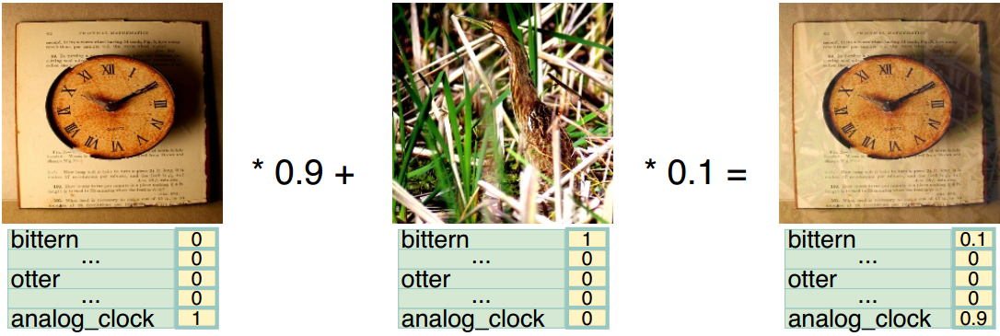
  - Label Smoothing:
  - Data Preprocessing techniques: random cropping, expansion, horizontal flip, resize, brightness, hue, saturation, contrast (with extra case in Object Detection case). The authors also noted that Two-Stage Detectors do not require extensive geometric augmentations due to the nature of ROIpooling.
  - Training Schedule: Warmup to avoid gradient exploding during the initial iteration (since, in the early of training stage, model tends to receive dominant gradient from negative examples). Secondly, StepLR or CosineAnnealing is frequently used to automatically reduce LR while training.
  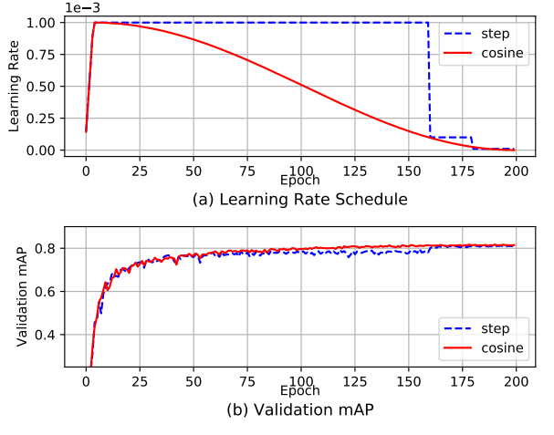
  - Synchronized Batch Normalization: normal batch normalization method works on single GPU work fine on training ImageNet due to large batch size. Therefore, it is better to gather statistic across GPUs.
  - Random Shape training for Single-Stage Detectors

- Some proposed to combine segmentation into detector. [Mask RCNN](https://arxiv.org/pdf/1703.06870.pdf) introduces a separate branch to detect mask and a different Pooling layer (RoIAlign). Two added features boost performance of baseline Faster-RCNN by ~1% mAP.
