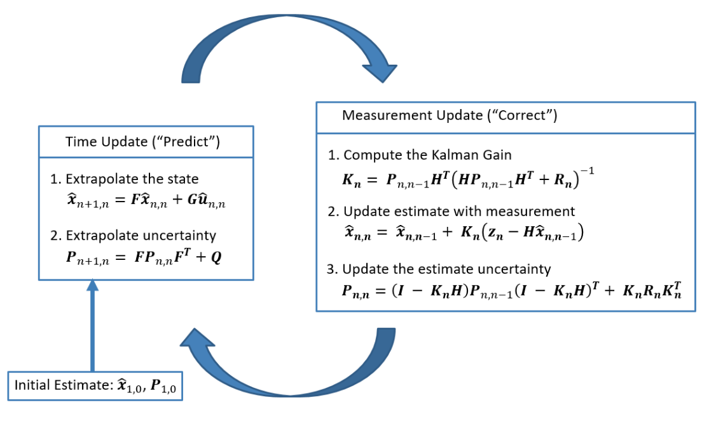
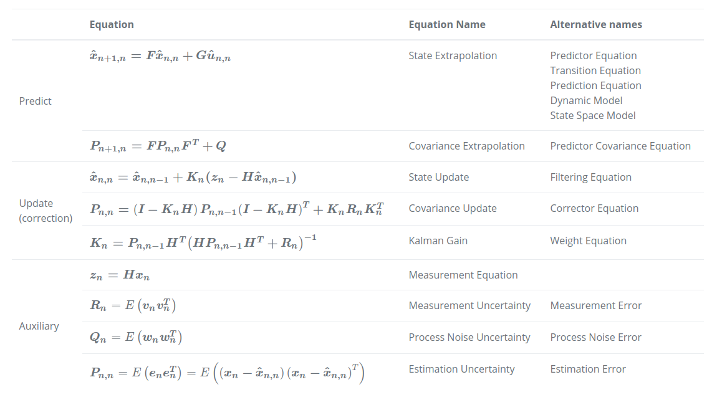
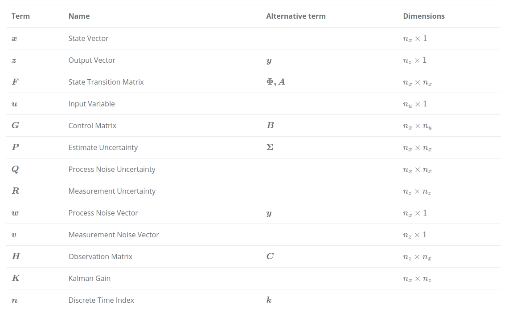

# Multiple Objects Tracking
- Multiple Objects Tracking (MOT), also called Multi-Target Tracking (MTT), is a computer vision that aims to analyze videos in order to identify and track objects belonging to one or more categories, such as pedestrians, cars, animals and inanimate objects, without prior knowledge about the appearance and number of targets.

- MOT algorithms associates target ID to each box (known as a *detection*), in order to distinguish among intra-class objects (i.e. person1 vs. person2).

- MOT tasks can be 2D and 3D, and both single-camera and multi-camera scenarios.

## Introduction
- The standard approach employed in MOT algorithms is *tracking-by-detection* (i.e. bounding boxes identifying the targets in the image).
- MOT algorithms can be divided into batch and online methods. 
  - Batch tracking can use future information (often more accurate, in comparison with Online Tracking).
  - Online tracking use only present and past information.

- Most MOT algorithms share the following procedure:
  - **Detection stage**: an object algorithm analyzes each input frame to identify objects belonging to the target class(es).
  - **Feature extraction/motion prediction stage**: one or more feature extraction algorithms analyze the detections and/or the tracklets to extract appearance, motion and/or interaction features. Optionally, a motion predictor predicts the next position of each tracked target.
  - **Affinity stage**: features and motion predictions are used to compute a similarity/distance socre between pairs of detections and/or tracklets.
  - **Association stage**: the similarity/distance measures are used to associate detections and tracklets belonging to the same target by assigning the same ID to detections that identify the same target.

## Metrics
- Classic metrics:
  - *Most Tracked* (MT) trajectories: number of ground-truth trajectories that are correctly tracked in at least 80% of the frame.
  - *Fragments*: trajectory hypotheses which cover at most 80% of a ground-truth trajectory. Observe that a true trajectory can be covered by more than one fragment.
  - *Mostly Lost* (ML) trajectories: number of ground-truth trajectories that are correctly tracked in less than 20% of the frames.
  - *False trajectories*: predicted trajectories which do not correspond to a real object (i.e. to a ground truth trajectory).
  - *ID switches*: number of times when the object is correctly tracked, but the associated ID for the object is mistaken changed.

- CLEAR MOT metrics:
  if ground-truth o_j and the hypothesis h_j are matched in frame t-1 and in frame t the IOU(o_j, h_j) > 0.5, then o_j and h_j are matched in that frame, even if exists another hypothesis h_k such that IoU(o_i, h_j) < IOU(o_i, h_k).

  - FN: = sum(False negatives), False negative = a ground truth box which cannot be matched with remaining hypotheses.
  - FP: = sum(False positives), False positive = a hypothesis which cannot be matched with any real boxes.
  - Fragm: = sum(fragmentations), fragmentation = a interrupted ground truth object which is later resumed.
  - IDSW: = sum(ID switches), ID switch = a tracked ground truth object ID is incorrectly changed during tracking duration.
  - GT: number of ground truth boxes. 
 
  MOTA score (from __*-inf to 1*__) is then defined as follows:
  
  MOTA = 1 - (FN + FP + IDSW)/GT

- ID scores (focus on tracking objects for the longest time possible, inorder not to lose its position) (still ambiguous)

## Results
- MOTA and number of FNs is highly correlated (with a coefficient of 0.95). Hence, best performance models are the ones that have the lowest number of FNs.
- ID-switch happends more frequently in Online Tracking, compared to Batch Tracking.

## Kalman filter 
- Using measured information(s) to estimate true value
- Visit [source](https://www.kalmanfilter.net/) for more thorough explaination.

### Kalman filter in one dimension
- Lag error in Kalman filter (Liquid example) can be caused by:
  - The dynamic model doesn't fit the case
  - The process model reliability. (low process noise, while the real temperature fluctuations are much bigger)

- Fix by:
  - Define a new model that takes into account a possible change.
  - If the model is not well defined, adjust the process model reliability by increasing the process noise.

### Summary 
- Complete picture of the Kalman Filter operations
  
  

- Table describes Kalman Filter equations:

  

- Tables summarizes notations:
  
  

## Simple Online and Realtime Tracking (SORT)
- Best algorithm on MOT2015

| Adv | Disadv |
|-----|--------|
|Fast |High number of ID switches (which is addressed in DeepSort)|

- Approach:
  - Use FasterRCNN for pedestrian detections
  - Use Kalman filter to predict trajectories (one Kalman tracker for one Object)
  - Compute IoU and use Hungarian Algorithm to match new detection + kalman tracker (if non-match, create new tracker)

